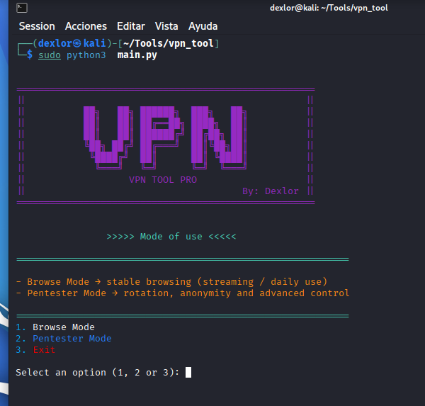

# 🛡️ VPN Tool Pro



> CLI tool for managing WireGuard VPN connections with dual modes: stable browsing and advanced pentesting.

---

## 🚀 Features

- 🌐 **Browse Mode** → stable VPN for daily use / streaming  
- 🕵️ **Pentester Mode** → IP rotation, kill switch, automation  
- 🔁 Auto-retry & server failover  
- 🚫 Blacklist system (avoid failing servers)  
- 📊 Real-time dashboard (IP, country, status)  
- 🎨 Colored CLI + hacker-style UI  

---

## 📸 Demo


---

## 📊 Dashboard Preview


---

## 📦 Installation

```bash
git clone https://github.com/youruser/vpn-tool-pro.git
cd vpn-tool-pro
pip install -r requirements.txt
